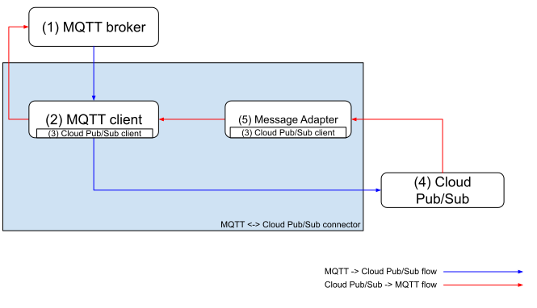

# MQTT <-> Cloud Pub/Sub Connector design document

In this document, we describe the design of the **MQTT <-> Cloud Pub/Sub connector**.

We decided to name this project a connector rather than a message broker to emphasize its generic nature for something
that connects MQTT brokers and Cloud Pub/Sub, and acts as a thin translation layer.

## Expected deliverables

- Source code of all the software components and related release artifacts, hosted in
  publicly accessible repositories (this code repository).
- [Infrastructure-as-code descriptors to provision the cloud resources for a testing and validation environment](../README.md#provision-a-test-and-validation-runtime-environment-on-google-cloud).
- [Comprehensive, automated test suites](./development-environment.md).
- Documentation about the design (this document), [testing](./development-environment.md),
  how to use ([authentication guide](./authentication.md), [configuration guide](./configuration.md)), and
  [how to contribute](../CONTRIBUTING.md) to each component.
- [Documentation about release and maintenance processes](./build-release-processes.md).

## Goals

The MQTT <-> Cloud Pub/Sub Connector is aimed at providing a “thin” layer to let MQTT messages published by MQTT
clients end up in Cloud Pub/Sub topics as Cloud Pub/Sub messages, and vice versa.

### Non-goals

- Map all available MQTT semantics to Cloud Pub/Sub.
- Map all available Cloud Pub/Sub semantics to MQTT.
- Develop a MQTT broker.
- Develop a MQTT client.
- Dynamically create and delete Cloud Pub/Sub topics and subscriptions to align with MQTT topics and subscriptions.
- Provide best practices and guidance to deploy a MQTT broker.
- Map MQTT clients identities to Google Cloud identities.

## Architecture

In this section, we describe the architecture of the MQTT <-> Cloud Pub/Sub Connector.

This architecture is aimed at connecting MQTT brokers to Cloud Pub/Sub.

The following diagram shows the components of the MQTT <-> Cloud Pub/Sub Connector and how they interact, along with
their external dependencies.

The preceding diagram can be summarized as follows. The description of the diagram is relatively verbose to avoid
confusion between overlapping MQTT and Cloud Pub/Sub terms.

### Message flows

- **MQTT to Cloud Pub/Sub**. This flow highlights how MQTT messages published in MQTT topics end up in Cloud Pub/Sub
  topics as Cloud Pub/Sub messages.
- **Cloud Pub/Sub to MQTT**. _(not yet implemented)_ This flow highlights how Cloud Pub/Sub messages published in
  Cloud Pub/Sub topics end up in MQTT topics as MQTT messages.

### Components

1. **MQTT broker**. MQTT clients connect to this broker.
2. **MQTT client**. This MQTT client does the following:

    1. Connects to the MQTT broker and subscribes to the MQTT topics whose messages the customer wants to send to Cloud
      Pub/Sub.
    2. Receives MQTT messages from the subscribed MQTT topics.
    3. Publishes the MQTT messages it receives to the destination Cloud Pub/Sub topic.
    4. Subscribes to the mqtt-messages-to-send Cloud Pub/Sub topic, and publishes them as MQTT messages via the MQTT
      broker.

3. **Cloud Pub/Sub client**. This client is responsible for every interaction with Cloud Pub/Sub so that components
  don’t have to implement their own logic to do so. Google Cloud provides libraries for different programming languages
  already.
4. **Cloud Pub/Sub**. This is the instance of Cloud Pub/Sub that the connector publishes messages to, and fetches the
  messages to send to MQTT clients.
5. **Message adapter**. _(not yet implemented)_ This adapter subscribes to the source Cloud Pub/Sub topic, adapts the
  Cloud Pub/Sub messages it receives to prepare them to be sent as MQTT messages, and publishes them to the destination
  Cloud Pub/Sub topic. We may revise the purpose of (and the need for) this component once we start designing the Cloud
  Pub/Sub -> MQTT flow.

### Assumptions about the MQTT <-> Cloud Pub/Sub Connector architecture

- The message adapter is not involved in the MQTT -> Cloud Pub/Sub message flow because we don’t want to implement any
  transformation besides the ones that are strictly necessary to translate a MQTT message into a Cloud Pub/Sub message.
  The idea here is to dump the whole MQTT message content and use it as the payload of a Cloud Pub/Sub message.
- The components of the MQTT <-> Cloud Pub/Sub Connector are decoupled and use Cloud Pub/Sub as a communication channel
  so that they can scale independently.
- An instance of the MQTT <-> Cloud Pub/Sub Connector connects to one, and only one MQTT broker.
- The Cloud Pub/Sub client component is distributed across the other components of the connector.
- Unless specified otherwise, the Cloud Pub/Sub subscriptions are Pull subscriptions.
- The MQTT <-> Cloud Pub/Sub Connector doesn't maintain any information about the identity of the MQTT clients.
- The MQTT <-> Cloud Pub/Sub Connector trusts the MQTT broker to handle authentication of MQTT clients.
- The MQTT <-> Cloud Pub/Sub Connector doesn’t implement any authorization mechanism to check if MQTT clients have the
  permission to publish messages that will be published to Cloud Pub/Sub topics, nor if Cloud Pub/Sub clients have the
  permission to publish messages that will be published to MQTT topics.
- The MQTT <-> Cloud Pub/Sub Connector relies on Google Cloud IAM to handle authentication and authorization to interact
  with other Google Cloud services.

## Design

When designing the MQTT <-> Cloud Pub/Sub Connector, we followed the following principles:

- Rely on the minimum set of privileges.
- Focus on testability.
- Take scalability into account because we might have to support from thousands to millions of clients sending and
  receiving messages.
- Ensure containerization and deployability across different runtime platforms.
- Minimize the state to keep track of, and rely on Cloud Pub/Sub or other managed services to maintain such state
  when possible.
- Use language-neutral message serialization mechanisms.
- Use language-neutral remote procedure calling (RPC) mechanisms.
- Use asynchronous communication mechanisms when possible.

### Messages

In this section, we describe the design of the messages exchanged between the components of the MQTT <-> Cloud Pub/Sub
Connector.

For this project, we use a language-neutral message serialization mechanism:
[Protocol Buffers](https://developers.google.com/protocol-buffers). Protocol Buffers are portable and extensible enough
to avoid locking us down to specific programming languages or implementations, and there are already implementations of
code generators for different languages.

Protocol Buffers also allows us to use different programming languages for each component, while still maintaining a
consistent message serialization format.

### Remote procedure calling

In this section, we describe the design of the Remote procedure calling (RPC) mechanism that the components of the
MQTT <-> Cloud Pub/Sub Connector use to communicate.

For this project, we use a language-neutral remote procedure calling mechanism: [gRPC](https://grpc.io/). The most
important arguments for gRPC are: performance, interoperability between different languages, tooling availability for
different languages, and code generation.

### Architecture components

In this section, we describe the design of the components of the MQTT <-> Cloud Pub/Sub Connector.

The choice of the programming languages to use to implement the components of the MQTT <-> Cloud Pub/Sub Connector is mainly based on:

- Expected performance
- Availability of libraries and tooling
- Experience and skills of the team

Because of our choice to use language-neutral message serialization and remote procedure calling mechanisms, choosing a
programming language to implement a given component doesn’t prevent us from adapting our design later, or from using
different programming languages for different components.

Based on the criteria described above, the most likely programming language candidates for most components of the
MQTT <-> Cloud Pub/Sub Connector are Python, Java, and Go. We decided to leave out C++ even though the most important
libraries (MQTT, Protocol Buffers, gRPC) are available for that programming language to avoid the overhead due to using
a relatively low-level programming language and considering that we have Go among the candidates.

#### MQTT client

- Programming language:
  - Excluding C and C++, and languages that don’t have a feature-complete MQTT Eclipse Paho library, we are left with
    Java and Python.
  - After assessing the [gRPC benchmark results](https://grpc.io/docs/guides/benchmarking/), and considering the
    potentially high scalability requirements that this connector has to support, we choose a Java-based implementation
    for this component.

- Frameworks and libraries:
  - Frameworks: [Quarkus](https://quarkus.io/)
  - Integration libraries: [Apache Camel](https://camel.apache.org/)
    - [Apache Camel Paho MQTT 5 component](https://camel.apache.org/components/3.18.x/paho-mqtt5-component.html):
      uses [Eclipse Paho](https://www.eclipse.org/paho/), which offers an implementation in different programming
      languages, although only the Java, Python, C, and C++ implementations
      [support both MQTT v3 and MQTT v5](https://www.eclipse.org/paho/index.php?page=downloads.php), and are the most
      feature-complete ones, at the time of writing.
    - [Google Pubsub :: Apache Camel](https://camel.apache.org/components/2.x/google-pubsub-component.html)

- MQTT topics:
  - Subscribes to: MQTT topics whose messages are to forward to Cloud Pub/Sub topics.
  - Publishes messages to: MQTT topics where Cloud Pub/Sub messages are being forwarded to from Cloud Pub/Sub topics.

- Cloud Pub/Sub topics:
  - Subscribes to: Cloud Pub/Sub topics whose messages are to forward to MQTT topics.
  - Publishes messages to: Cloud Pub/Sub topics where MQTT messages are being forwarded to from MQTT topics.
- Authentication to Google Cloud services: the Cloud Pub/Sub client uses Application Default Credentials to authenticate.

#### Cloud Pub/Sub client

Built on top of [Cloud Client libraries](https://cloud.google.com/apis/docs/cloud-client-libraries).

### Deployment platforms

In this section, we describe the platforms that we consider as deployment targets for this project:

- [Google Compute Engine](https://cloud.google.com/compute)
- [Google Kubernetes Engine](https://cloud.google.com/kubernetes-engine)

We don’t consider the following as deployment targets for this project:

- Cloud Functions, because they [don’t support TCP-based triggers](https://cloud.google.com/functions/docs/calling).
- Cloud Run, because it doesn’t support TCP-based triggers, but only
  [HTTP](https://cloud.google.com/run/docs/triggering/https-request),
  [gRPC](https://cloud.google.com/run/docs/triggering/grpc),
  [Websockets](https://cloud.google.com/run/docs/triggering/websockets), and
  [Cloud Pub/Sub](https://cloud.google.com/run/docs/triggering/pubsub-push) ones.

## References

- Benchmarks:
  - [gRPC benchmarks](https://grpc.io/docs/guides/benchmarking/).
  - [Debian language benchmarks](https://benchmarksgame-team.pages.debian.net/benchmarksgame/index.html)
- Cloud Pub/Sub emulator:
  - [Testing apps locally with the emulator](https://cloud.google.com/pubsub/docs/emulator)
